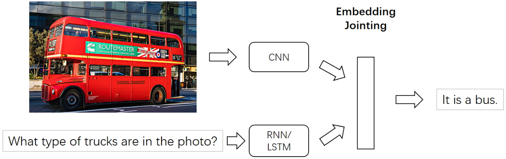
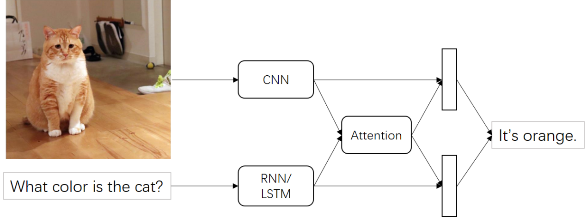

# 1 What is Visual Question Answering?
Visual question answering task is a challenging task in the field of artificial intelligence, which belongs to the intersection of computer vision and natural language processing. Until then, however, computer vision and natural language processing developed separately and made significant advances in their respective fields. With the continuous development of computer vision and deep learning, many computer vision tasks have made great progress, such as image classification(Huang et al. 2017), object detection(Redmon et al. 2016), and motion recognition(Narayana et al. 2018). However, the above tasks only need to perceive the image, without overall understanding and reasoning of the image. The visual question answering task takes the multi-modal information of the image (or video) and the text question related to the image (or video) as the input of the computer, and the computer gets the correct answer according to the picture.
The visual question answering task is now divided into two sub-tasks in the open and multiple choice form: the open visual question answering task is uncertain, and the correct answer is given by the computer, usually a few words or a simple phrase; The multiple-choice visual question answering task has candidate answers, and the computer selects the correct answer from the given candidate answers. Compared with other computer vision tasks, visual question answering task is more challenging: the question to be answered in visual question answering task is given at runtime, and multi-modal information of visual and text needs to be processed. The form of the question answer and how to get the answer are unknown. In contrast, for other computer vision tasks, the single question answered by the algorithm is predetermined and only the input image changes. The questions of the visual question answering task are of any type, and the types of questions mainly include the following categories: Object recognition, Object detection, Dual problem, Attribute classification, Scene classification, Counting problem and Text related.

# 2 What is the research significance of VQA and its application values?
Visual question answering is designed to allow the computer to automatically answer the query entered in natural language after understanding the content of the image or video. Visual question answering is also one of the basic research tasks in the field of visual language, and it is an important way to realize a user-oriented human-computer interactive visual system.
The research of visual question answering tasks has many practical applications, such as: it can help blind and visually impaired people to obtain more information on the Internet or in the real world, and even real-time human-computer interaction, which will greatly improve the blind and visually impaired people’s living conditions and convenience; to improve the way of human-computer interaction, visual content can be inquired through natural language, and the question and answer function of intelligent robots can be expanded; the visual question and answer system can be used in the field of image retrieval. Visual question answering tasks include most computer vision-related tasks. The continuous development of visual question answering tasks will surely bring progress in many fields.

# 3 How has VQA developed in recent years?
In recent years, the research of visual question answering tasks has received a lot of attention, and important advances have been made in datasets and models(Yu et al. 2018).
With the gradual emergence of standard data sets, some VQA methods have gradually exposed the problem of insufficient robustness. In order to avoid being affected by the surface correlation of the dataset, some studies have made efforts to improve the dataset and create a more balanced dataset. For example, the VQA v2 dataset（Goyal et al. 2017) balances the answer distribution, so that each question has at least two similar images with different answers. When the question answer distribution in the training set is significantly different from that in the testing set, the visual question answering model can avoid using the bias in the training set.
The visual question answering method has made great progress since it was proposed in 2014: the initial method mainly focused on the joint embedding of visual features and text features; later, with the introduction of the attention mechanism, the visual question answering model introduced the attention mechanism, it provides interpretability for the answer to the problem, and the effect has also made important progress. The combined model focuses on the reasoning process of question answering, but it does not perform well on natural image sets. For some problems that require external knowledge, the knowledge-based model has made progress in answering this part of the problem.

# 4 What are the current mainstream VQA methods?
This part will introduce four types of current mainstream VQA methods and show some examples.
## 4.1 Joint embedding method
The input of visual question and answering task is multi-modal information of visual features and text features, and the two features need to be mapped to a common feature space. The method of joint embedding was first applied in image description task. The VQA task had similar inputs to the image description task, but required further reasoning to arrive at an answer. Mapping visual features and text features to the same space is more conducive to information interaction and further reasoning answers（Malinowski  et al. 2015）. Therefore, joint embedding methods are further developed in visual question answering tasks. In most joint embedding methods, convolutional neural network is used to extract visual features, while cyclic neural network is used to extract text features, such as the example shown in Fig 1. The two features are combined by a simple mechanism (such as series element-by-element multiplication or element-by-element addition), and the combined features are sent into linear classifier or neural network.

Fig.1 The Framework of Joint Embedding Method

## 4.2 Attention method
Most of the above models use all the features extracted from the picture or question as the input of the VQA model, but the picture contains a lot of information that is not related to the question, and there are also words that need to be focused on in the question. Inputting all the features will lead to a large amount of noise is input into the classifier, which affects the accuracy of prediction. The purpose of the attention method is to focus on the problem-related areas in the picture or the most critical words in the problem. This mechanism simulates the cognitive model of the human brain, that is, the key to focusing limited attention on things according to actual needs part, which greatly strengthens the understanding of neural networks. For example, the question “What is the color of the car in the picture?”. In the question, “car” and “color” are keywords, and the area containing the car should get more attention. The attention method has achieved great success in other fields of vision and natural language processing, such as object recognition, image captioning, and machine translation. At present, there are a large number of VQA methods related to the attention mechanism(XU et al. 2015). For example, as shown in the Fig 2, the visual feature and text feature are simply multiplied to obtain the attention weight, the dimension of the attention weight is equal to the number of regions in the visual feature and the size of the weight represents the importance of the region. The visual feature is updated after the attention weight is multiplied by the visual feature.

Fig.2 The Framework of Attention Method

## 4.3 Combinatorial method
In the above methods, convolutional neural network and cyclic neural network are mainly used to extract features for fusion, and the training process lacks specific reasoning process. While the visual question answering task is constructive, for example, “what is on the table?”, first need to determine the position of the table, and then need to determine the position above the table, and then determine the object above the table and the type of the object. Therefore, some researches put forward the modular network to solve the VQA task, which designs different modules for different functions and connects modules according to different problems. Modular networks are easier to monitor and also provide interpretability for answering questions, in line with the logic of human question answering.
At present, the combinatorial method is mainly used in the synthetic image dataset, and the effect is relatively poor in the natural image dataset. The model relying on the language parser(Klein 2003) mainly carries out the reasoning of language logic and does not act on the reasoning process in the image. However, the combined model has great potential and provides an interpretable way to solve the VQA task, At present, the bottleneck may be that the extracted features are not enough to carry out the reasoning process. With the continuous progress of deep learning, the combinatorial method may make great progress.

## 4.4 Methods based on external knowledge
Visual question answering task is a very challenging task in artificial intelligence. Answering questions requires understanding the visual content of the image. The premise of understanding the visual content is to know certain non-visual information, such as answering "how many mammals are there in the picture?". First, you need to know whether the animals in the picture belong to mammals, this kind of question can only be answered with the help of external knowledge. Some studies combine visual question answering tasks with knowledge base, and some datasets are specifically aimed at this kind of method, such as kb-vqa dataset(Wang 2015) and fvqa dataset(Wang 2015). Because the knowledge in the training set is certain and cannot completely cover all the knowledge of answering questions, if you want to answer difficult questions, it is necessary to obtain knowledge from external knowledge base.

# 5 What are the challenges and prospects of VQA?
VQA task is a very serious challenge in the field of computer vision, which has a very wide application prospect. Despite the rapid development of visual question answering task in recent years, a variety of general datasets or datasets of a specific question have been put forward, but the current visual question answering model is not able to achieve the true meaning of question answering, and cannot interact well with human beings, it still needs to be continuously studied. In general, the visual question answering task is still in its infancy, and there are still many problems and challenges in various aspects. Such as:
(1) Lack of feature representation ability. The input features of the visual question answering model lose part of the image and text information in the extraction process, and the current visual features and text features are not enough to carry out reasoning in question answering, which depends on the emergence of better feature extraction and feature representation methods in the future. At present, the characteristics of the traditional fusion method is too simple, the future need to study how the visual features and text better fusion, the features of the merged contain more abundant information. The current features resulting from the fusion of commonly used as the input of the classifier, and the future work should establish better after fusion characteristics and the correlation between the answers.
(2) At present, most studies regard VQA task as multi-classification task, but multi-classification task can only get the answers that have appeared in the training set, which is inconsistent with the ultimate goal of artificial intelligence. The generative answer is more consistent with the normal logic, but it is limited by the evaluation of the answer, and the current method cannot accurately evaluate whether the predicted answer is consistent with the landmark answer. Among them, semantic grammar and other problems exist in sentence answers, which requires more accurate evaluation criteria to evaluate generative visual question answering tasks.
(3) Insufficient reasoning ability of models at present, most visual question answering models focus on getting better visual and text features, but lack the ability to reason the picture content according to the question. The combined model is still unsatisfactory in the performance of natural images, and cannot transform natural images into reasoning process. Although the attentional mechanism can make the model pay more attention to an important region or word, the model is still unexplainable in reasoning.
(4) In recent years, many studies have focused on how to eliminate the linguistic correlation of visual question answering models. Ablation studies show that the performance of question-only models is much better than that of image-only models. This shows that the model is more inclined to use text information to answer questions. Due to the bias of visual question answering data set, the model can use the bias of data set distribution to achieve a good effect, but this leads to a great difference between the results of the training set and the test set. The robustness and generalization ability of the model need to be further improved. Eliminating the surface correlation of the model is an important step to achieve this goal.
To solve these problems, the following aspects can be deeply studied in the future: building a more comprehensive and balanced data set, improving the interpretability of the model, and improving the robustness and generalization ability of the model.

# References: 
Goyal Y, Khot T, Summers-Stay D, Batra D, Parikh D. Making the V in VQA matter: Elevating the role of image understanding in visual question answering. In: Proc. of the IEEE Conf. on Computer Vision and Pattern Recognition. 2017. 6904−6913. [doi: 10.1109/CVPR.2017.670]

Huang G, Liu Z, Van Der Maaten LQ, Weinberger K. Densely connected convolutional networks. In: Proc. of the IEEE Conf. on Computer Vision and Pattern Recognition. 2017. 4700−4708. [doi: 10.1109/CVPR.2017.243] 

Klein D, Manning CD. Accurate unlexicalized parsing. In: Proc. of the 41st Annual Meeting of the Association for Computational Linguistics. 2003. 423−430.

Malinowski M, Rohrbach M, Fritz M. Ask your neurons: A neural-based approach to answering questions about images. In: Proc. of the IEEE Int’l Conf on Computer Vision. 2015. 1−9. [doi: 10.1109/ICCV.2015.9]

Narayana P, Beveridge R, Draper BA. Gesture recognition: Focus on the hands. In: Proc. of the IEEE Conf. on Computer Vision and Pattern Recognition. 2018. 5235−5244. [doi: 10.1109/CVPR.2018.00549]

Redmon J, Divvala S, Girshick R, Farhadi A. You only look once: Unified, real-time object detection. In: Proc. of the IEEE Conf. on Computer Vision and Pattern Recognition. 2016. 779−788. [doi: 10.1109/CVPR.2016.91]  

Wang P, Wu Q, Shen C, Van Den Hengel A, Dick A. Explicit knowledge-based reasoning for visual question answering. arXiv preprint arXiv:1511.02570, 2015. 

Wang P, Wu Q, Shen C, Dick A, Van Den Hengel A. FVQA: Fact-based visual question answering. IEEE Trans. on Pattern Analysis and Machine Intelligence, 2018,40(10):2413−2427.

Xu K, Ba J, Kiros R, Cho K, Courvile A, Salakhutdinov R, Zemel RS, Bengio Y. Show, attend and tell: Neural image caption generation with visual attention. In: Proc. Int’l Conf. on Machine Learning. 2015. 2048−2057.

Yu J, Wang L, Yu Z. Research on visual question answering techniques. Journal of Computer Research and Development, 2018, 55(9):1946−1958 (in Chinese with English abstract).